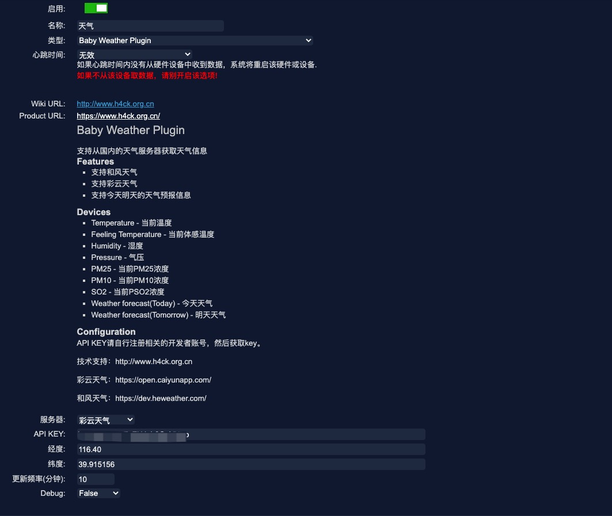
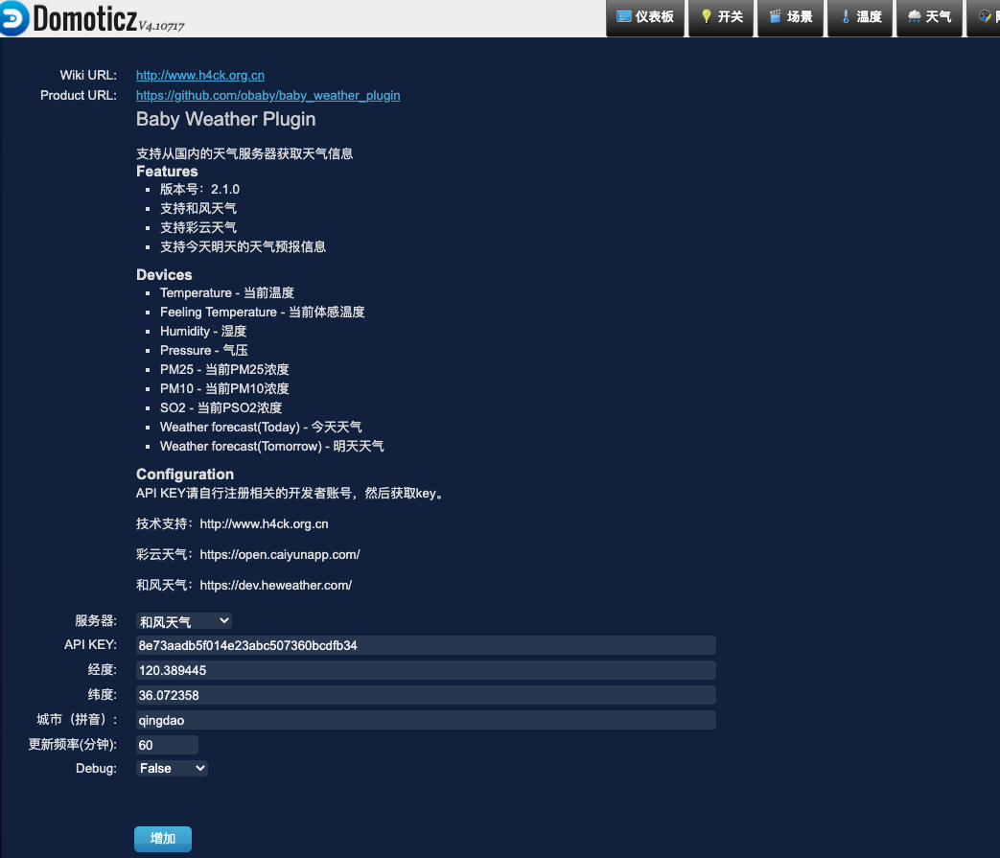
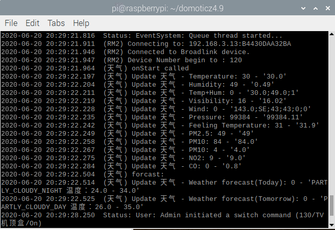
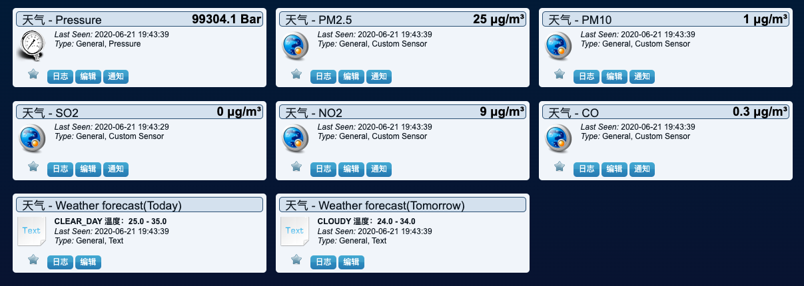
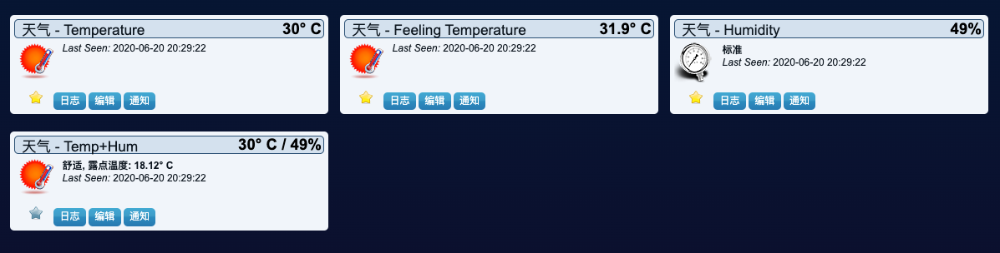
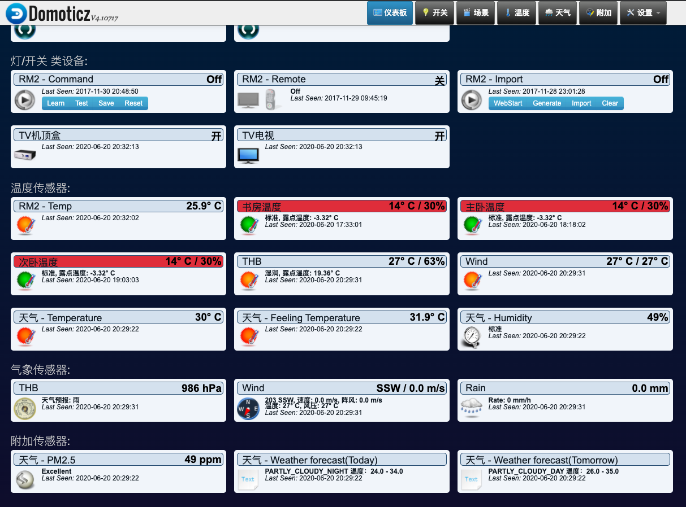

Domoticz Baby Weather Plugin
====

支持彩云天气，和风天气，需要注册开发者账号之后添加apikey之后才能使用。  
彩云天气：https://open.caiyunapp.com/  
和风天气：https://dev.heweather.com/  

支持信息：  
- Temperature - 当前温度
- Feeling Temperature - 当前体感温度
- Humidity - 湿度
- Pressure - 气压
- PM25 - 当前PM25浓度
- PM10 - 当前PM10浓度
- SO2 - 当前PSO2浓度
- Weather forecast(Today) - 今天天气
- Weather forecast(Tomorrow) - 明天天气
- 等等  

安装方法：
> 1. 下载zip之后解压缩，放入Domoticz/plugins目录下，重启服务端。去网页端添加硬件即可。  
> 2. 切换到插件目录下，git clone https://github.com/obaby/baby_weather_plugin 重启服务端。去网页端添加硬件即可。  
> 3. 和风天气的控制质量接口，通过经纬度进行获取会提示没有权限，所以需要输入当前城市的拼音。如果没有空气质量信息，请检查这个参数是否正确。


添加硬件截图：  
  
V2.1.6版本更新：
  
终端运行效果:  
  

数据信息：  
  
  
  
  

项目依赖：  
requests
```bash
pip3 install requests
```

更新日志：  
-----

V2.1.6 (2020.07.01)
- 增加和风天气的空气指数
- 修改数据更新为独立线程处理


V2.1.0 (2020.06.23)
- 修复和风天气湿度数值未获取
- 调整和风天气预报逻辑，16：00之后今天的天气预报改为晚间数据


V2.0.1 (2020.06.22)
- 修改传感器Temp+Hum为Temp+Hum+Baro
- 增加Temp+Hum+Baro天气预报
- 修复气压数值错误
- 增加天气预报舒适度
- 增加天气预报具体天气信息（受限于domoticz目前只有几个天气信息，其余的例如雪、大风天气数值目前不知道，无法实现）

-----
> @author: obaby  
> @license: (C) Copyright 2013-2020, obaby@mars.  
> @contact: root@obaby.org.cn  
> @link: http://www.obaby.org.cn  
> @blog: http://www.h4ck.org.cn  
> @findu: http://www.findu.co  